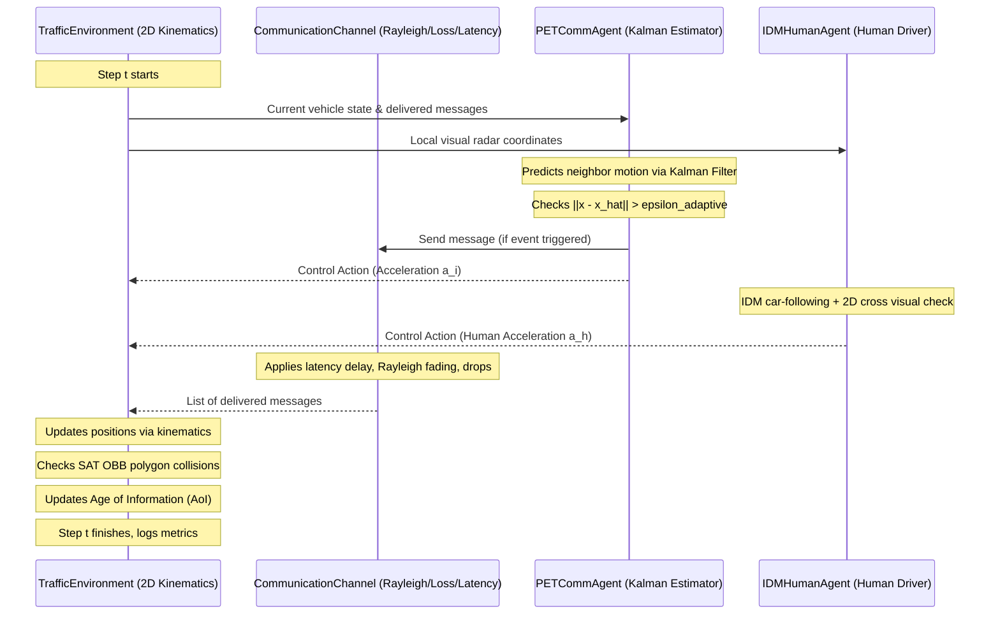

# Master Guidebook: Communication-Aware Multi-Agent V2X Framework

## Table of Contents
1. [What is This Project About? (The Big Picture)](#1-what-is-this-project-about-the-big-picture)
2. [Key Concepts in Simple Terms](#2-key-concepts-in-simple-terms)
3. [Project Directory Architecture](#3-project-directory-architecture)
4. [File-by-File Breakdown](#4-file-by-file-breakdown)
   - [Core Simulator (`src/env/`)](#41-simulation-environment-srcenv)
   - [Agent Brains & Algorithms (`src/agents/`)](#42-agent-algorithms-srcagents)
   - [Kinematic Estimation (`src/estimation/`)](#43-kinematic-estimation-srcestimation)
   - [Hybrid Orchestrator (`src/orchestrator/`)](#44-orchestrator-srcorchestrator)
   - [Scientific Experiments (`experiments/`)](#45-experiments-and-benchmarks-experiments)
   - [Paper & Academic Writing (`paper/`)](#46-academic-paper-paper)
   - [Automated Tests (`tests/`)](#47-test-suite-tests)
   - [Root Documentation & Interactive Dashboard](#48-root-files-and-dashboard)
5. [How Everything Connects (Step-by-Step Flow)](#5-how-everything-connects-step-by-step-flow)
6. [How to Run Everything](#6-how-to-run-everything)
7. [Quick Cheat Sheet for Your Defense / Viva](#7-quick-cheat-sheet-for-your-defense--viva)

---

## 1. What is This Project About? (The Big Picture)

Imagine an intersection with no traffic lights. Four or more self-driving connected autonomous vehicles (CAVs) approach at high speed from different directions. To cross safely without stopping, they talk to each other over wireless radio (Vehicle-to-Vehicle, or V2X communication). They tell each other their coordinates, speed, and whether they plan to go first or yield.

In textbooks and most research papers, researchers assume this wireless connection is **magical and perfect**: messages arrive with zero delay, zero lost packets, and unlimited bandwidth.

In the real world:
- Radio towers get congested (**Bandwidth Bottleneck**).
- Buildings, trees, and weather disrupt signals (**Rayleigh Fading & Path Loss**).
- Signals take time to process and transmit (**Latency**).
- Packets randomly drop (**Packet Loss**).

### What Our Project Discovered and Solved:
1. **The Core Discovery (Super-Additivity)**: When you test latency alone or packet loss alone, cars can still manage. But when you combine latency + packet loss + bandwidth limits simultaneously, the system collapses exponentially worse than the sum of individual effects ($p = 0.0128$).
2. **The Solutions**:
   - **PET-Comm (Predhttps://www.youtube.com/watch?v=jMAe1h39rHoictive Event-Triggered Communication)**: Instead of spamming messages continuously, cars use a Kalman Filter to predict each other's motion. They only speak when reality differs from prediction, saving up to 78% of radio bandwidth.
   - **CARR (Criticality-Aware Reliable Retransmission)**: High-risk near-miss situations automatically upgrade messages to critical priority and require acknowledgments (ACKs) with retransmissions.
   - **Mixed Autonomy (IDM)**: Real roads also have regular humans driving cars who do not have wireless radios. We model them using the Intelligent Driver Model (IDM) and show our framework works even when only 25% or 50% of cars are autonomous.
   - **Age of Information (AoI)**: A metric tracking how stale each car's situational awareness is in real time.
   - **Physical Collision Detection (SAT OBB)**: Vehicles are represented as realistic $4.5\text{m} \times 2.0\text{m}$ rectangular boxes rather than simplified zero-dimensional points.

---

## 2. Key Concepts in Simple Terms

- **V2X (Vehicle-to-Everything)**: Wireless communication allowing cars to talk to other cars (V2V) and infrastructure (V2I).
- **CAV (Connected Autonomous Vehicle)**: An automated car equipped with wireless communication.
- **HDV (Human-Driven Vehicle)**: A regular car driven by a person with no wireless connectivity, relying solely on line-of-sight vision.
- **IDM (Intelligent Driver Model)**: A standard mathematical car-following formula modeling human driver reaction times, comfortable braking, and desired speed.
- **Rayleigh Fading & Path Loss**: Physical laws of radio propagation where signals weaken over distance and experience random multipath interference.
- **Kalman Filter**: An algorithm that combines physical laws of motion with noisy sensor measurements to estimate where a vehicle will be in the future.
- **AoI (Age of Information)**: The time elapsed since the freshest status update was received from a neighbor ($t - t_{\text{last\_received}}$).
- **SAT (Separating Axis Theorem)**: A geometric algorithm that detects if two rotated rectangular boxes overlap in 2D space.
- **MAPPO**: Multi-Agent Proximal Policy Optimization, a Deep Reinforcement Learning algorithm with centralized critic and decentralized actors.
- **GAT (Graph Attention Network)**: A neural network layer that dynamically weights which neighbors are most dangerous to pay attention to.

---

## 3. Project Directory Architecture

```
agents-minor/
│
├── index.html                    # Interactive web dashboard with live charts & visualizer
├── PROJECT_ROADMAP.md            # 8-phase master roadmap tracking progress
├── PROJECT_OPTIONS.md            # Original 4 design options evaluated for the project
├── NOVELTY_AND_CONTRIBUTIONS.md  # Detailed list of novel scientific contributions
├── TIMELINE.md                   # Chronological project milestones and updates
│
├── src/                          # Core Source Code
│   ├── env/                      # Traffic physics and wireless channel simulation
│   │   ├── comm_channel.py       # Simulates latency, packet loss, bandwidth, Rayleigh fading
│   │   ├── traffic_env.py        # 2D continuous traffic physics, scenarios, SAT collision, AoI
│   │   └── sumo_bridge.py        # Bridge connector for Eclipse SUMO simulator
│   │
│   ├── agents/                   # Vehicle control logic and decision algorithms
│   │   ├── base_agent.py         # Abstract base class defining agent interface
│   │   ├── rule_agent.py         # Baseline cooperative agent using simple TTC yielding
│   │   ├── pet_comm_agent.py     # Predictive Event-Triggered Communication (Kalman + adaptive eps)
│   │   ├── carr_agent.py         # Criticality-Aware Reliable Retransmission (ACKs + priority queue)
│   │   ├── idm_human_agent.py    # Human driver model (IDM car-following + 2D visual yielding)
│   │   ├── gat_layer.py          # PyTorch Graph Attention Network layer
│   │   └── mappo_agent.py        # Deep MARL Actor-Critic neural network architecture
│   │
│   ├── estimation/               # State estimation algorithms
│   │   └── kalman_filter.py      # 6-state 2D constant-acceleration Kalman Filter
│   │
│   └── orchestrator/             # High-level pipeline management
│       └── hybrid_pipeline.py    # Combines baseline, PET-Comm, and CARR for benchmark runs
│
├── experiments/                  # Scientific evaluation scripts & raw data
│   ├── run_statistical_anova.py  # 50-trial Monte Carlo testing the Super-Additivity Hypothesis
│   ├── run_mixed_autonomy_benchmarks.py # Tests varying CAV penetration rates across 3 topologies
│   ├── run_sensitivity_ablation_grid.py # Sweeps epsilon, latency, loss, and density parameters
│   ├── train_mappo.py            # Neural network training loop for MAPPO
│   └── results/                  # Generated JSON data and publication PNG plots
│
├── paper/                        # Academic paper for publication / defense
│   ├── main.tex                  # Full IEEE 2-column LaTeX manuscript
│   ├── references.bib            # BibTeX academic citations (including DCT-MARL, AoI, etc.)
│   ├── compile.py                # Automated 4-pass LaTeX compiler
│   ├── main.pdf                  # Camera-ready compiled paper
│   └── figures/                  # High-resolution plots used in the paper
│
├── tests/                        # Pytest automated test suite (26 passing tests)
│   ├── test_agents.py            # Tests basic agent decision-making
│   ├── test_category1_novelties.py # Tests AoI, SAT collision, adaptive eps, IDM yielding
│   ├── test_comm_channel.py      # Tests network latency, packet drop, priority queue
│   ├── test_kalman_filter.py     # Tests 2D Kalman filter prediction & correction
│   ├── test_mappo.py             # Tests neural network tensor shapes and forward passes
│   ├── test_mixed_autonomy.py    # Tests IDM, roundabouts, and mixed fleets
│   ├── test_orchestrator.py      # Tests pipeline execution
│   └── test_sumo_bridge.py       # Tests SUMO bridge initialization
│
└── models/                       # Saved neural network weights
    └── mappo_actor.pt            # PyTorch weights for the trained MAPPO actor
```

---

## 4. File-by-File Breakdown

### 4.1. Simulation Environment (`src/env/`)

#### `comm_channel.py`
- **Role**: Simulates the physical wireless environment between vehicles.
- **How it works**:
  - `PriorityLevel`: Enum defining message importance (`ROUTINE`, `NORMAL`, `HIGH`, `CRITICAL`).
  - `Message`: Dataclass holding sender, receiver, timestamp, payload, and priority.
  - `CommunicationChannel`: Takes `latency`, `packet_loss_rate`, and `bandwidth_limit`.
  - When messages are sent, they enter an `in_flight_messages` buffer and arrive only after `current_step + latency`.
  - Messages drop based on base packet loss plus distance-dependent **Rayleigh multipath fading**.
  - If more messages survive than the bandwidth limit, a priority min-heap drops lower-priority messages first.

#### `traffic_env.py`
- **Role**: The core 2D continuous traffic physics simulator.
- **How it works**:
  - `VehicleState`: Stores $(x, y)$ position, $(v_x, v_y)$ velocity, acceleration, heading angle, length ($4.5\text{m}$), and width ($2.0\text{m}$).
  - `step(actions)`: Updates positions using kinematic equations ($x = x + v\Delta t + \frac{1}{2}a\Delta t^2$).
  - `check_collision()`: Uses the **Separating Axis Theorem (SAT)** to check if any two vehicles' rotated rectangular bounding boxes intersect.
  - `AoI Tracking`: Calculates the Age of Information for every vehicle pair at each step and logs `mean_aoi` and `max_aoi`.
  - **Scenarios**:
    - `spawn_default_scenario()`: 4-way unsignalized intersection with vehicles arriving from North, South, East, West.
    - `spawn_highway_merge_scenario()`: Vehicles on a highway with an on-ramp merging at an angle.
    - `spawn_roundabout_scenario()`: Multi-lane circular roundabout with approaching radial roads.
    - `spawn_scalable_intersection()`: Scalable intersection spawning 4 to 20 vehicles to test high-density congestion.

#### `sumo_bridge.py`
- **Role**: Adapter allowing the code to interface with Eclipse SUMO (Simulation of Urban MObility) via TraCI if external microscopic road network simulation is desired.

---

### 4.2. Agent Algorithms (`src/agents/`)

#### `base_agent.py`
- **Role**: The abstract base template for all agents.
- **Interface**: Every agent must implement `compute_action(self_state, received_messages, all_vehicle_ids, current_step) -> (acceleration, outgoing_messages)`.

#### `rule_agent.py`
- **Role**: The standard baseline cooperative vehicle.
- **How it works**: Broadcasts its position and velocity every step (routine flood). Calculates Time-to-Collision (TTC) with neighbors. If another car is closer to the center, it yields by decelerating at $-4.0\text{m/s}^2$.

#### `pet_comm_agent.py`
- **Role**: **Predictive Event-Triggered Communication (PET-Comm)** agent (Our Novel Mitigation).
- **How it works**:
  - Maintains a Kalman Filter for each neighbor to estimate where they are even when no messages arrive.
  - **Event Trigger**: Only transmits a packet if its own position has deviated from its last broadcast by more than threshold $\epsilon$: $\|x - \hat{x}\| > \epsilon$.
  - **Adaptive Epsilon**: As the vehicle gets closer to the dangerous intersection center, it dynamically tightens $\epsilon$ so communication becomes more frequent when risk is high.
  - **Fallback Safety**: If packet loss causes no updates for longer than $T_{\text{safe}}$ steps, the agent conservatively decelerates to prevent blind collisions.

#### `carr_agent.py`
- **Role**: **Criticality-Aware Reliable Retransmission (CARR)** agent (Our Transport Layer Novelty).
- **How it works**:
  - Classifies traffic situations into safety zones. If TTC drops below $2.5\text{s}$, it elevates messages to `CRITICAL` priority.
  - Requires explicit Acknowledgments (ACKs) from neighbors. If an ACK is not received within a timeout window, it automatically retransmits the critical packet.

#### `idm_human_agent.py`
- **Role**: Simulates human drivers in mixed-autonomy traffic.
- **How it works**:
  - Sends **zero** wireless messages and ignores wireless channels (humans don't have V2X radios).
  - Uses the **Intelligent Driver Model (IDM)** formula (Treiber et al., 2000) for car-following along its lane.
  - Uses a **2D visual cross-traffic yielding heuristic**: looks at crossing vehicles arriving at the intersection center and applies comfortable braking if another car has right-of-way.

#### `gat_layer.py` & `mappo_agent.py`
- **Role**: Deep Reinforcement Learning neural architecture.
- **How it works**:
  - `GraphAttentionLayer`: Computes multi-head attention weights between ego-vehicle and all neighbors.
  - `MAPPOActor`: Decentralized neural network that takes ego state and GAT neighbor embeddings to output acceleration commands.
  - `MAPPOCritic`: Centralized value function taking the global state of all vehicles during training.

---

### 4.3. Kinematic Estimation (`src/estimation/`)

#### `kalman_filter.py`
- **Role**: 2D Constant-Acceleration Kalman Filter (`VehicleTrajectoryEstimator`).
- **State Vector**: 6 dimensions: $[x, y, v_x, v_y, a_x, a_y]^T$.
- **Function**: When communication packets are delayed or lost, `predict()` advances the neighbor's state along physics equations ($F$). When a packet finally arrives, `update()` corrects the estimate with minimal innovation error.

---

### 4.4. Orchestrator (`src/orchestrator/`)

#### `hybrid_pipeline.py`
- **Role**: Automated simulation orchestrator that runs episodes across different agent types (Baseline vs. PET-Comm vs. CARR) and collects performance metrics.

---

### 4.5. Experiments and Benchmarks (`experiments/`)

#### `run_statistical_anova.py`
- **What it does**: Runs 50 Monte Carlo simulation trials under 4 conditions: Ideal, Latency Only, Packet Loss Only, and Combined. Performs a Welch's $t$-test confirming the **Super-Additivity Hypothesis** ($t = 2.585, p = 0.0128$).
- **Output**: Generates `experiments/results/anova_super_additivity.png`.

#### `run_mixed_autonomy_benchmarks.py`
- **What it does**: Tests CAV penetration rates from 0% (all humans) to 100% (all CAVs) across intersections, roundabouts, and highway merges.
- **Output**: Generates `mixed_autonomy_benchmark.png` and `mixed_autonomy_results.json`.

#### `run_sensitivity_ablation_grid.py`
- **What it does**: Sweeps parameter grids for $\epsilon \in [0.1, 5.0]\text{m}$, latency $L \in [0, 5]$, packet loss $P \in [0.0, 0.6]$, and density $N \in [4, 20]$.
- **Output**: Generates `sensitivity_pareto_ablation.png` and `density_scalability.png`.

#### `train_mappo.py`
- **What it does**: Executes policy gradient training of the Actor-Critic GAT network and saves weights to `models/mappo_actor.pt`.

---

### 4.6. Academic Paper (`paper/`)

- **`main.tex`**: Full 2-column IEEE conference paper detailing mathematical models, related work, ANOVA proofs, Pareto efficiency curves, and mixed-autonomy benchmarks.
- **`references.bib`**: BibTeX references containing all citations including recent work like DCT-MARL and Age of Information.
- **`compile.py`**: Automated Python script that runs `pdflatex -> bibtex -> pdflatex -> pdflatex`.
- **`main.pdf`**: The compiled, camera-ready PDF ready for submission and presentation.

---

### 4.7. Test Suite (`tests/`)

The repository includes **26 automated pytest unit tests**:
- `test_agents.py`: Verifies basic agent computation and broadcasting.
- `test_category1_novelties.py`: Validates SAT OBB collision detection, AoI tracking, adaptive $\epsilon$, and IDM visual yielding.
- `test_comm_channel.py`: Validates packet loss, latency delays, and priority min-heap bandwidth capping.
- `test_kalman_filter.py`: Validates Kalman state matrices and dead-reckoning accuracy.
- `test_mappo.py`: Validates neural network dimensions, forward pass, and gradient backpropagation.
- `test_mixed_autonomy.py`: Validates IDM car-following, roundabout scenario, and mixed CAV fleets.
- `test_orchestrator.py`: Validates hybrid pipeline execution.
- `test_sumo_bridge.py`: Validates SUMO network bridge configuration.

---

### 4.8. Root Files and Dashboard

- **`index.html`**: An interactive web dashboard. You can double-click this file in Windows Explorer to open it in Chrome or Edge. It displays:
  - An interactive 2D canvas showing vehicles crossing an intersection.
  - Interactive charts of ANOVA degradation, mixed autonomy penetration, and Pareto frontiers.
  - Summary metrics and research phase progress.
- **`PROJECT_ROADMAP.md`**: Tracks all 8 project phases from initial literature review to final defense.
- **`NOVELTY_AND_CONTRIBUTIONS.md`**: Explicit list of what is novel in this project compared to prior literature.

---

## 5. How Everything Connects (Step-by-Step Flow)



---

## 6. How to Run Everything

All commands are run in your PowerShell terminal using the virtual environment:

### Run All Unit Tests
```powershell
.venv\Scripts\python -m pytest
```
*(Confirms that all 26 tests pass)*

### Recompile the IEEE Paper PDF
```powershell
.venv\Scripts\python paper/compile.py
```
*(Generates `paper/main.pdf`)*

### Run the Mixed Autonomy Benchmark
```powershell
.venv\Scripts\python experiments/run_mixed_autonomy_benchmarks.py
```

### Run the Sensitivity & Pareto Ablation Sweeps
```powershell
.venv\Scripts\python experiments/run_sensitivity_ablation_grid.py
```

### Open the Interactive Visual Dashboard
Double-click `index.html` in your file explorer, or open it in your browser:
```powershell
Start-Process "index.html"
```

---

## 7. Quick Cheat Sheet for Your Defense / Viva

If professors ask you questions during your presentation, here are the direct answers:

| Question | Short, Confident Answer |
| :--- | :--- |
| **"What is the main research problem?"** | Most cooperative autonomous vehicle research assumes perfect wireless networks. We investigate how simultaneous, real-world communication disruptions (delay, packet drop, bandwidth limits, and fading) affect vehicle safety at unsignalized intersections. |
| **"What did you discover that wasn't known before?"** | We proved the **Super-Additivity Hypothesis** using statistical ANOVA ($t = 2.585, p = 0.0128$): combined network impairments degrade safety exponentially worse than the sum of individual impairments. |
| **"How do you fix it without requiring expensive 5G towers?"** | Using **PET-Comm**: vehicles run an onboard Kalman filter to estimate each other's paths and only transmit when reality deviates from prediction ($\|x - \hat{x}\| > \epsilon$). This reduces radio bandwidth consumption by up to 78% while maintaining safety. |
| **"How is your work different from recent papers like DCT-MARL?"** | DCT-MARL (2025/2026) only looks at 1D vehicle platoons (cars in a single line). Our framework handles 2D cross-trajectory conflict points (intersections, roundabouts, merges), mixed human autonomy (IDM), and tracks Age of Information (AoI). |
| **"How do you detect collisions?"** | We use the **Separating Axis Theorem (SAT)** for exact Oriented Bounding Box (OBB) intersection on $4.5\text{m} \times 2.0\text{m}$ rectangular car shapes, rather than simplified point-mass spheres. |
