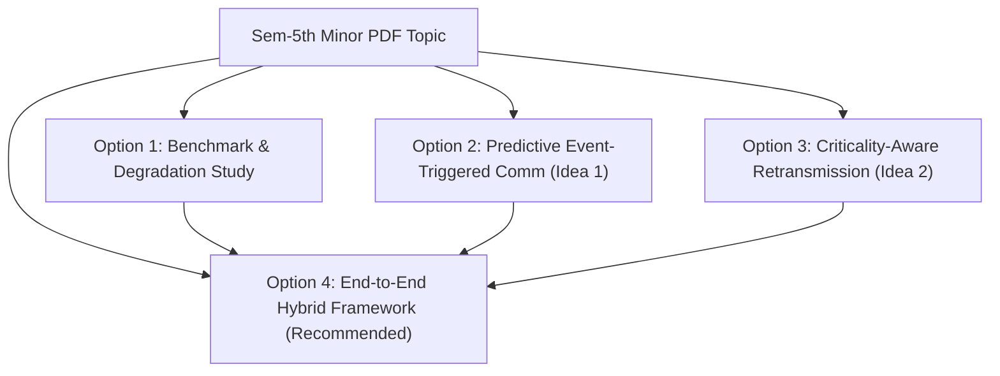

# Communication-Aware Cooperative Agents: Project Implementation Options

## Executive Summary

Based on the project presentation [Sem-5th minor.pdf](file:///C:/Users/Pranjal/Documents/GitHub/agents-minor/Sem-5th%20minor.pdf), this project investigates **Communication-Aware Cooperative Autonomous Agents** in Vehicle-to-Everything (V2X) and transportation coordination scenarios.

### Core Problem & Research Gap
Existing Multi-Agent Reinforcement Learning (MARL) and communicative agent frameworks (such as AgentComm-Bench, TMC, IntNet, and ETCNet) predominantly test communication failures in isolation (e.g. only packet loss OR only latency) or use toy grid/game environments. 

**Unaddressed Research Gap**: No prior benchmark systematically evaluates cooperative multi-agent transportation tasks under **simultaneous, combined network disruptions** (joint packet loss, operational latency/delay, and bandwidth constraints) using an interpretable agent design.

---

## Proposed Options for Project Execution

Here are four structured paths for executing the project, ranging from foundational empirical analysis to advanced protocol development.



---

### Option 1: Empirical Benchmark & Combined Degradation Study (RQ1 Focus)

**Goal**: Build a multi-agent transportation simulation to empirically prove/disprove Hypothesis 1: *Combined communication impairments degrade coordination performance super-additively (worse than the sum of individual failure effects).*

* **Key Deliverables**:
  1. **Simulation Environment**: A cooperative scenario (e.g., 4-way unsignalized intersection or highway lane merging) using `highway-env` or `SUMO` (via `traci`).
  2. **Network Channel Wrapper**: A custom communication pipe that injects:
     * Latency ($L$ timesteps delay)
     * Packet Loss ($P_{\text{loss}}$ drop probability)
     * Bandwidth Limit ($B$ max messages per timestep)
  3. **Evaluation Suite**: Quantitative analysis comparing isolated impairments ($L$ only, $P_{\text{loss}}$ only, $B$ only) against joint impairments ($L + P_{\text{loss}} + B$).
* **Metrics**: Collision rate, average speed, task completion time, throughput, message overhead.
* **Pros**: Directly answers RQ1 from the presentation; provides clear empirical plots and tables for evaluation; highly achievable within project timelines.

---

### Option 2: Predictive Event-Triggered Communication (PET-Comm)

**Goal**: Implement an adaptive state-prediction mechanism (Idea 1 from initial proposal) that minimizes bandwidth requirements while maintaining safety under lossy communication.

* **Key Deliverables**:
  1. **Local Motion Predictor**: Each agent maintains a state estimation model (Kalman Filter or Constant Acceleration Dead-Reckoning) predicting neighboring agents' trajectories ($\hat{x}_{t}$).
  2. **Event Trigger Logic**: Agents only broadcast state/intent vectors when actual state deviates beyond threshold $\epsilon$:
     $$\|x_{t} - \hat{x}_{t}\| > \epsilon$$
  3. **Loss Fallback Strategy**: When packet loss is detected, agents propagate predictions up to a safety time horizon $T_{\text{safe}}$ before triggering conservative emergency braking.
* **Metrics**: Bandwidth savings (percentage reduction in messages sent), collision rate vs. threshold $\epsilon$.
* **Pros**: High technical depth; demonstrates bandwidth efficiency without sacrificing safety.

---

### Option 3: Criticality-Aware Reliable Retransmission (CARR) Protocol

**Goal**: Implement a prioritized message transport layer with automatic retransmission for high-severity events (Idea 2 from initial proposal).

* **Key Deliverables**:
  1. **Message Severity Classifier**: Classifies outgoing communications into routine state updates vs. high-severity alerts (e.g., sudden braking, emergency lane change).
  2. **ACK & Retransmission Protocol**: High-severity messages require explicit acknowledgement (ACK) from neighboring agents. If ACK is dropped within timeframe $\tau$, trigger retransmission using exponential backoff or transmission power boost.
  3. **Trade-off Evaluation**: Measure the small spike in message overhead versus the prevention of critical collisions.
* **Metrics**: Packet delivery reliability for critical messages, collision avoidance under high loss rates, latency penalty.
* **Pros**: Solves catastrophic "single dropped packet leads to collision" failure modes.

---

### Option 4: Comprehensive End-to-End Framework (Recommended Path)

**Goal**: Combine Options 1, 2, and 3 into a complete research and implementation package.

* **Phase 1: Base Environment & Impairment Channel Setup**
  * Establish multi-agent scenario (`highway-env` / `SUMO`).
  * Build the realistic non-stationary communication failure channel module.
* **Phase 2: Baseline & RQ1 Verification**
  * Implement baseline cooperative rule-based/MARL controllers.
  * Execute single vs. combined impairment experiments to validate super-additive performance degradation.
* **Phase 3: Mitigation Strategies (PET-Comm + CARR)**
  * Implement predictive event-triggered communication and criticality-aware ACK protocol.
  * Evaluate PET-Comm + CARR against baseline under severe combined network disruptions.

---

## Recommended Technology Stack & Architecture

| Component | Recommended Tool / Library | Purpose |
| :--- | :--- | :--- |
| **Simulation Engine** | `highway-env` / `PettingZoo` (or `SUMO`) | Multi-agent vehicle control and traffic simulation |
| **Agent Controller** | PyTorch / Rule-based Heuristics / Ray RLlib | Policy implementation (MARL or Cooperative Rules) |
| **Prediction Models** | `filterpy` / SciPy / PyTorch | Kalman Filter / trajectory estimation for PET-Comm |
| **Network Channel** | Python custom wrapper / SimPy | Injecting latency, packet loss, bandwidth caps |
| **Visualization & Plots** | Matplotlib / Seaborn / TensorBoard | Result generation and comparative evaluation graphs |

---

## Suggested Deliverables File Structure

```text
agents-minor/
├── Sem-5th minor.pdf
├── PROJECT_OPTIONS.md
├── requirements.txt
├── src/
│   ├── env/
│   │   ├── traffic_env.py         # Multi-agent traffic scenario wrapper
│   │   └── comm_channel.py        # Network impairment injector (loss, latency, bandwidth)
│   ├── agents/
│   │   ├── base_agent.py          # Abstract agent definition
│   │   ├── rule_agent.py          # Rule-based cooperative baseline agent
│   │   ├── pet_comm_agent.py      # Predictive Event-Triggered Comm agent
│   │   └── carr_agent.py          # Criticality-Aware Retransmission agent
│   ├── estimation/
│   │   └── kalman_filter.py       # Trajectory estimation model
│   └── utils/
│       └── metrics.py             # Collision, bandwidth, throughput logging
├── experiments/
│   ├── run_rq1_combined_tests.py  # Isolated vs Combined impairment experiments
│   └── run_mitigation_tests.py   # PET-Comm / CARR evaluation
└── README.md
```
