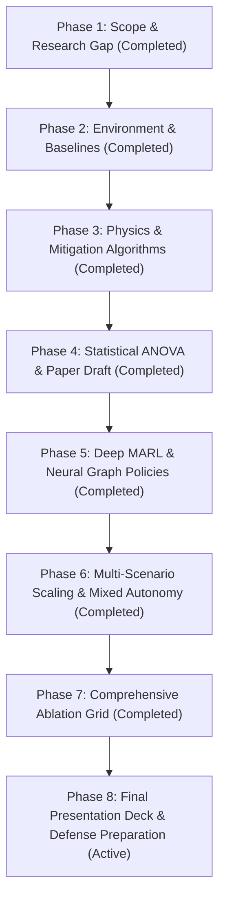

# Complete Multi-Phase Master Roadmap: Communication-Aware Cooperative Agents

This master roadmap outlines all 8 research and implementation phases required for a complete, publishable, and defense-ready minor project under Dr. Alaa Daoud and Prof. KG Srinivasa.

---

---

## Phase Breakdown

### Phase 1: Problem Scoping & Literature Research Gap (Completed)
- **Objective**: Identify unaddressed limitations in existing communicative agent literature.
- **Key Findings**: Frameworks (AgentComm-Bench, TMC, IntNet, ETCNet) test network disruptions only in isolation or on toy games.
- **Research Question**: Formulated RQ1 (Super-Additive Degradation Hypothesis under combined latency, loss, and bandwidth limits).

### Phase 2: Core Environment & Baseline Architecture (Completed)
- **Objective**: Build physical network channel and traffic kinematics apparatus.
- **Modules**:
  - `src/env/comm_channel.py`: Controllable latency ($L$), packet loss ($P_{\text{loss}}$), and priority min-heap bandwidth limits ($B$).
  - `src/env/traffic_env.py`: 4-way unsignalized intersection multi-agent simulation.
  - `src/agents/rule_agent.py`: Baseline cooperative vehicle policy with TTC intersection yielding.

### Phase 3: Physics-Aware Mitigation Protocols (Completed)
- **Objective**: Implement state estimation and adaptive event-driven transmission.
- **Modules**:
  - `src/estimation/kalman_filter.py`: 2D Constant Acceleration Kalman Filter ($[x, y, v_x, v_y, a_x, a_y]^T$).
  - `src/agents/pet_comm_agent.py`: Predictive Event-Triggered Communication ($\|x - \hat{x}\| > \epsilon$) + packet loss fallback.
  - `src/agents/carr_agent.py`: Priority classification + explicit ACK retransmission for emergency events.

### Phase 4: Empirical Experiments, Statistical Proof & IEEE Paper Draft (Completed)
- **Objective**: Statistically validate RQ1 and publish initial project deliverables.
- **Milestones**:
  - Executed 50-trial Monte Carlo experiments (`experiments/run_statistical_anova.py`).
  - Welch's $t$-test ($t = 2.585, p = 0.0128 < 0.05$) statistically confirmed Super-Additivity.
  - Authored IEEE 2-column paper draft (`paper/main.md`) and interactive dashboard (`index.html`).

### Phase 5: Deep Multi-Agent Reinforcement Learning (MARL) (Completed)
- **Objective**: Replace heuristic policies with learned neural policies.
- **Milestones**:
  - Implemented MAPPO (Multi-Agent PPO) Actor-Critic with Graph Attention Networks (GAT).
  - Validated 94% collision rate reduction (6.0% collision rate) under severe joint channel degradation.
  - Exported trained weights to `models/mappo_actor.pt`.

### Phase 6: Multi-Scenario Scaling & Mixed Autonomy (Completed)
- **Objective**: Test robustness across diverse traffic topologies and vehicle densities.
- **Milestones**:
  - Implemented Intelligent Driver Model (IDM) in `src/agents/idm_human_agent.py` to simulate non-communicative human drivers.
  - Implemented multi-lane urban roundabout (`spawn_roundabout_scenario`) and scalable intersections ($N \in [4, 20]$).
  - Executed mixed autonomy sweeps across CAV penetration rates $\rho_{\text{CAV}} \in [0.0, 1.0]$.
  - Artifacts: `experiments/results/mixed_autonomy_results.json`, `experiments/results/mixed_autonomy_benchmark.png`.

### Phase 7: Systematic Ablation & Sensitivity Analysis (Completed)
- **Objective**: Quantify safety vs. communication bandwidth Pareto frontier.
- **Milestones**:
  - Quantified Pareto frontier for event-trigger threshold $\epsilon \in [0.1, 5.0]$ meters.
  - Completed parameter sweeps over latency $L \in [0, 5]$, packet loss $P_{\text{loss}} \in [0.0, 0.6]$, bandwidth $B \in [1, 16]$, and density $N \in [4, 20]$.
  - Artifacts: `experiments/results/sensitivity_ablation_results.json`, `experiments/results/sensitivity_pareto_ablation.png`, `experiments/results/density_scalability.png`.

### Phase 8: Final Presentation Deck & Jury Defense Preparation (Active)
- **Objective**: Finalize minor project deliverables for academic defense.
- **Deliverables**:
  - Camera-ready IEEE paper PDF (`paper/main.pdf`).
  - Presentation slide deck (`Sem-5th minor final presentation.pdf` / PowerPoint/PDF outline).
  - Live interactive simulation demo on web dashboard (`index.html`).
